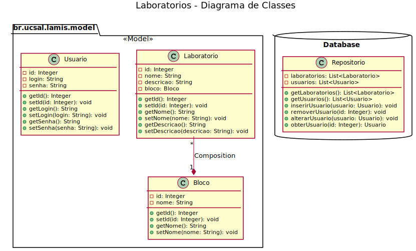
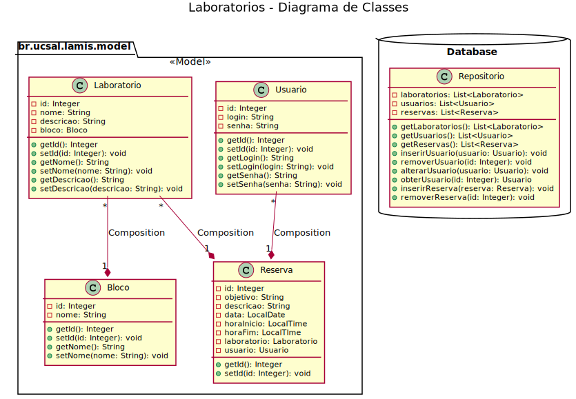

# LABORATORIOS UCSAL

O código apresenta apenas o conteúdo visto na AVI:
* HTML
* CSS
* JavaScript
* Java
* JSP
* JSTL
* EL


Para atender aos requisitos de mapeamento e agendamento dos laboratorios da universidade a primeira versão foi desenvolvida com base no diagrama de classes.


                                    
Agora faremos a evolução do projeto :) inserindo a possibilidade de fazer reservas de laboratorios: 
 



## IMPLEMENTAÇÕES NECESSARIAS
1. [ ] FILTRO PARA FAZER LOG DE ACESSO (1.0)

> - O FILTRO DEVE EXIBIR A URL, O LOGIN E A HORA DE ACESSO NO FORMATO dd/MM/yyyy hh:mm:ss. Caso não exista usuario exibir 'ANONIMO'. Ex.:
>> - LOGIN: admin HORARIO: 02/10/2019 10:00:30 ' .../index.jsp' ou 
>> - LOGIN: ANONIMO HORARIO: 02/10/2019 10:00:30 ' .../index.jsp'   

2. [ ] COMPLETE A CLASSE RESERVA (0.5)

> - Classe que vai representar uma reserva de um laboratorio. Essa classe deve conter:
>> - id do tipo Integer
>> - laboratorio do tipo Laboratorio
>> - dia da reserva do Tipo LocalDate
>> - hora de inicio do tipo LocalTime
>> - hora do fim do tipo LocalTime
>> - objetivo do tipo String
>> - descrição do tipo String
>> - usuario do tipo Usuario

3. [ ] LISTA DE RESERVA (1.0)

> - Voce deve apresentar uma pagina com lista de reservas. A pagina deve conter: 
>> - Link para criar uma nova reserva
>> - Lista de reservas onde cada linha deve conter:
>>> - Nome do Laboratorio
>>> - hora de inicio da reserva
>>> - hora do fim da reserva
>>> - Link para excluir a reserva

4. [ ] FORMULÁRIO DA RESERVA (1.0)

> -  Essa formulario deve permitir que o usuario:
>> - selecione o laboratorio
>> - indique: o dia da reserva
>> - hora de inicio da reserva
>> - hora do fim da reserva
>> - objetivo da reserva 
>> - descrição da reserva

5. [ ] SERVLET PARA SALVAR A RESERVA (1.0)

> -  Essa servlet deve obter os dados do formulario e salvar uma nova reserva.
>> - Obtenha os dados do formulario
>> - Converta as datas
>> - Não esqueça de preencher o laboratorio obtendo a partir do Id
>> - E preencher o usuario com objeto que esta na sessao

6. [ ] SERVLET PARA EXLUIR A RESERVA  (0.5)

> -  Essa servlet deve excluir a reserva.

7. [ ] RESTRIÇÕES (1.0)

> -  Crie restrição na servlet de salvar para não permitir salvar 2 reservas no mesmo dia e horario para um mesmo laboratorio.


## DICAS

```Java
//Convertendo de uma String "21/10/2017" para um java.time.LocalDate
//import java.time.format.DateTimeFormatter;
DateTimeFormatter dateFormat = DateTimeFormatter.ofPattern("dd/MM/yyyy");
String data = "21/10/2017";
r.setData(LocalDate.parse(data, dateFormat));

//Convertendo de uma String "13:59" para um java.time.LocalDate
DateTimeFormatter timeFormat = DateTimeFormatter.ofPattern("H:mm");
String hora = "13:59";
r.setHora(LocalTime.parse(hora, timeFormat));

```

